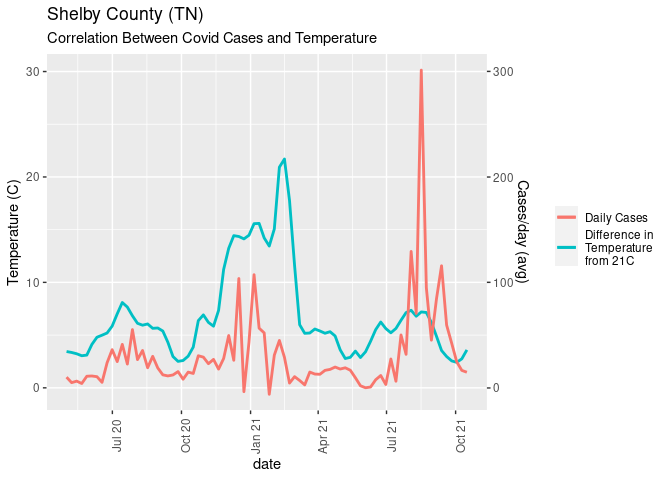
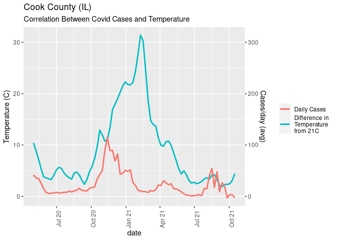
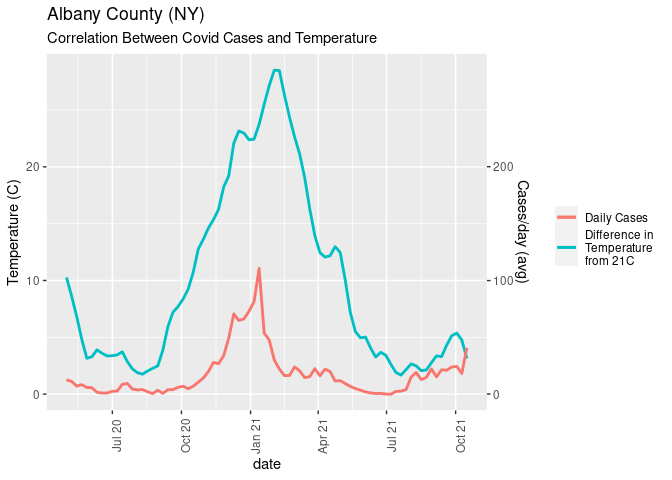
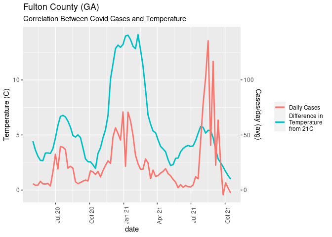
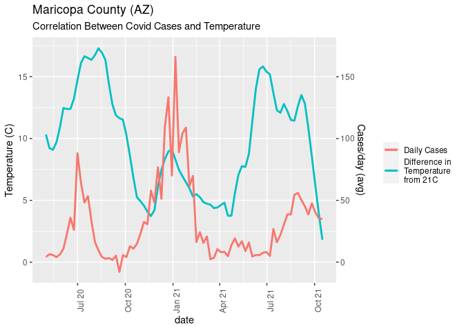
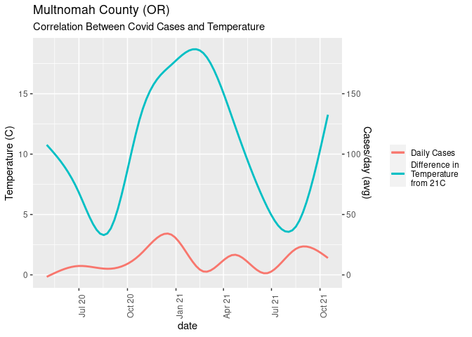
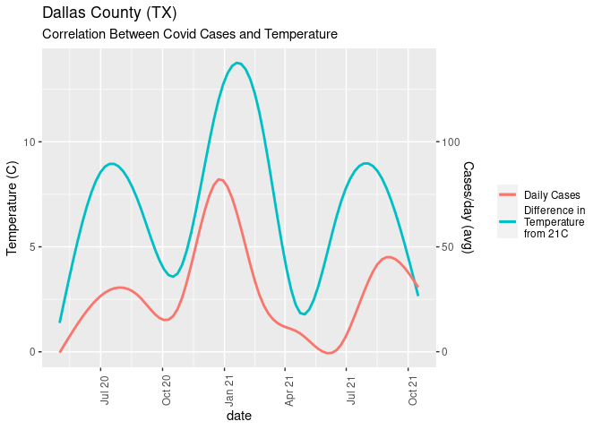
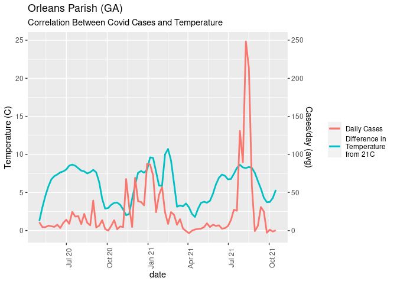
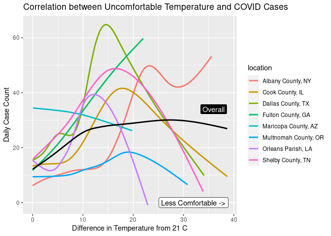

COVID-19
================
Team Delta
2021-10-20

-   [Investigating Temperature &
    COVID-19](#investigating-temperature--covid-19)
    -   [Question](#question)
    -   [Relevant Background](#relevant-background)
    -   [Data](#data)
        -   [Quality of Data](#quality-of-data)
        -   [Load and Configure Data](#load-and-configure-data)
    -   [Results & Observations](#results--observations)
        -   [County-Level Plots](#county-level-plots)
    -   [Conclusions](#conclusions)
    -   [Remaining Questions](#remaining-questions)

# Investigating Temperature & COVID-19

*Team Delta: Katie, Hazel, Jen, Sydney, & Shamama*

## Question

In this report, we aim to explore the following question: “Does outside
temperature affect COVID cases?”

## Relevant Background

In our lived experience of this pandemic we noticed national spikes in
covid cases in very hot and very cold months. We hypothesized that this
could be because during months when outside temperature was not
comfortable, people would tend to congregate inside more and therefore
cause more spread in the virus. We wanted to see if the trend of harsher
weather correlating with higher numbers of cases held up on a county
level.

## Data

In addition to the [NYT COVID
data](https://github.com/nytimes/covid-19-data) and [County-level
Population Estimates](https://data.census.gov/cedsci/) provided to us in
Challenge 06, we also used the [rOpenSci rnoaa
package](https://docs.ropensci.org/rnoaa/). This package serves as an R
interface to several different NOAA data sources, including historical
weather data. Using this data, we want to plot COVID cases against
temperature from May of 2020 to October of 2021 in seven counties. We
choose the seven counties due to them having complete data in the noaa
database, as well as being geographically diverse. In addition, we
decided to only look at data from after May 2020, because before then,
case counts were more unreliable before widespread testing became
available.

### Quality of Data

As a national administration, NOAA’s data can be assumed to be accurate,
and generally unbiased. However, there are certain places where data are
incomplete, or not in an ideal format. The most recent date of the
dataset varies a lot by county. For example, Orleans Parish, LA has very
recent historical data, ending about a week ago. However, Middlesex, CT
data ends about a year ago. Additionally, in the daily temperature
dataset, some locations have data for maximum temperature, some have
data for minimum temperature, and some have data for average
temperature. This makes it difficult to compare weather between
locations.

### Load and Configure Data

``` r
library(tidyverse)
```

    ## ── Attaching packages ─────────────────────────────────────── tidyverse 1.3.1 ──

    ## ✓ ggplot2 3.3.5     ✓ purrr   0.3.4
    ## ✓ tibble  3.1.4     ✓ dplyr   1.0.7
    ## ✓ tidyr   1.1.3     ✓ stringr 1.4.0
    ## ✓ readr   2.0.1     ✓ forcats 0.5.1

    ## ── Conflicts ────────────────────────────────────────── tidyverse_conflicts() ──
    ## x dplyr::filter() masks stats::filter()
    ## x dplyr::lag()    masks stats::lag()

**Load Census Data.**

Make sure the column names are
`id, Geographic Area Name, Estimate!!Total, Margin of Error!!Total`.

See the README.md file for instructions to download this data from the
Census Bureau website.

``` r
filename <- "./data/census.csv"

## Load the data
df_pop <- 
  read_csv(filename, skip = 1) %>% 
  mutate("fips" = str_remove(id, "\\d+[:alpha:]+"))
```

    ## Rows: 3221 Columns: 4

    ## ── Column specification ────────────────────────────────────────────────────────
    ## Delimiter: ","
    ## chr (3): id, Geographic Area Name, Margin of Error!!Total
    ## dbl (1): Estimate!!Total

    ## 
    ## ℹ Use `spec()` to retrieve the full column specification for this data.
    ## ℹ Specify the column types or set `show_col_types = FALSE` to quiet this message.

**Automated Download of NYT Data**

The New York Times is publishing up-to-date data on COVID-19 on
[GitHub](https://github.com/nytimes/covid-19-data).

``` r
url_counties <- "https://raw.githubusercontent.com/nytimes/covid-19-data/master/us-counties.csv"

filename_nyt <- "./data/nyt_counties.csv"

## Download the data locally
curl::curl_download(
        url_counties,
        destfile = filename_nyt
      )

## Loads the downloaded csv
df_covid <- read_csv(filename_nyt)
```

    ## Rows: 1832858 Columns: 6

    ## ── Column specification ────────────────────────────────────────────────────────
    ## Delimiter: ","
    ## chr  (3): county, state, fips
    ## dbl  (2): cases, deaths
    ## date (1): date

    ## 
    ## ℹ Use `spec()` to retrieve the full column specification for this data.
    ## ℹ Specify the column types or set `show_col_types = FALSE` to quiet this message.

Combine COVID and Census Data

``` r
## NOTE: No need to change; run this to produce a more convenient tibble
df_data <-
  df_covid %>%
  left_join(df_pop, by = "fips") %>% 
  select(
    date,
    county,
    state,
    fips,
    cases,
    deaths,
    population = `Estimate!!Total`
  )
```

**Normalize COVID Data**

``` r
## TASK: Normalize cases and deaths
df_normalized <-
  df_data %>%
  group_by(county) %>%
  mutate("cases_per100k" = (cases / population) * 100000) %>%
  mutate("deaths_per100k" = (deaths / population) * 100000) %>%
  ungroup()

glimpse(df_normalized)
```

    ## Rows: 1,832,858
    ## Columns: 9
    ## $ date           <date> 2020-01-21, 2020-01-22, 2020-01-23, 2020-01-24, 2020-0…
    ## $ county         <chr> "Snohomish", "Snohomish", "Snohomish", "Cook", "Snohomi…
    ## $ state          <chr> "Washington", "Washington", "Washington", "Illinois", "…
    ## $ fips           <chr> "53061", "53061", "53061", "17031", "53061", "06059", "…
    ## $ cases          <dbl> 1, 1, 1, 1, 1, 1, 1, 1, 1, 1, 1, 1, 1, 1, 1, 1, 1, 1, 1…
    ## $ deaths         <dbl> 0, 0, 0, 0, 0, 0, 0, 0, 0, 0, 0, 0, 0, 0, 0, 0, 0, 0, 0…
    ## $ population     <dbl> 786620, 786620, 786620, 5223719, 786620, 3164182, 52237…
    ## $ cases_per100k  <dbl> 0.12712619, 0.12712619, 0.12712619, 0.01914345, 0.12712…
    ## $ deaths_per100k <dbl> 0, 0, 0, 0, 0, 0, 0, 0, 0, 0, 0, 0, 0, 0, 0, 0, 0, 0, 0…

``` r
df_tidy <- df_normalized %>% 
  separate(date,
           into = c("year", "month", "day"),
           sep = "-", 
           remove = FALSE) %>% 
  mutate(year = as.integer(year), 
         month = as.integer(month), 
         day = as.integer(day))

df_tidy
```

    ## # A tibble: 1,832,858 × 12
    ##    date        year month   day county      state      fips  cases deaths population
    ##    <date>     <int> <int> <int> <chr>       <chr>      <chr> <dbl>  <dbl>      <dbl>
    ##  1 2020-01-21  2020     1    21 Snohomish   Washington 53061     1      0     786620
    ##  2 2020-01-22  2020     1    22 Snohomish   Washington 53061     1      0     786620
    ##  3 2020-01-23  2020     1    23 Snohomish   Washington 53061     1      0     786620
    ##  4 2020-01-24  2020     1    24 Cook        Illinois   17031     1      0    5223719
    ##  5 2020-01-24  2020     1    24 Snohomish   Washington 53061     1      0     786620
    ##  6 2020-01-25  2020     1    25 Orange      California 06059     1      0    3164182
    ##  7 2020-01-25  2020     1    25 Cook        Illinois   17031     1      0    5223719
    ##  8 2020-01-25  2020     1    25 Snohomish   Washington 53061     1      0     786620
    ##  9 2020-01-26  2020     1    26 Maricopa    Arizona    04013     1      0    4253913
    ## 10 2020-01-26  2020     1    26 Los Angeles California 06037     1      0   10098052
    ## # … with 1,832,848 more rows, and 2 more variables: cases_per100k <dbl>,
    ## #   deaths_per100k <dbl>

``` r
df_daily <- df_tidy %>% 
  group_by(fips) %>% 
  mutate(
    daily_case_count = cases_per100k - lag(cases_per100k),
    daily_death_count = deaths_per100k - lag(deaths_per100k)
  )
```

**Weather Data**

Follow instructions linked
[here](https://docs.ropensci.org/rnoaa/articles/rnoaa.html)

``` r
library('rnoaa')
```

    ## Registered S3 method overwritten by 'hoardr':
    ##   method           from
    ##   print.cache_info httr

``` r
# Replace with your key from here: https://www.ncdc.noaa.gov/cdo-web/token
# Remember to delete your actual API key before git pushing!
options(noaakey = "mXlBMxxMYipwDjTiNYqCqZSTVjvFyDSH")
```

``` r
get_weather_data <- 
  function(FIPS) {
    out1 <- ncdc(
    datasetid='GHCND', # Daily summaries dataset
    locationid = str_c("FIPS:", FIPS),
    datatypeid='TAVG',
    startdate = '2020-05-01',
    enddate = '2020-12-31' ,
    limit = 1000
    )
    
    out2 <- ncdc(
    datasetid='GHCND', # Daily summaries dataset
    locationid = str_c("FIPS:", FIPS),
    datatypeid='TAVG',
    startdate = '2021-01-01',
    enddate = '2021-10-16',
    limit = 1000
    )
    
  out <- bind_rows(out1$data, out2$data)
  #Combine took too long
  # out <- ncdc_combine(out1, out2)
  out
  }
```

``` r
get_weather_data("36001") %>% 
  head()
```

    ## # A tibble: 6 × 8
    ##   date                datatype station           value fl_m  fl_q  fl_so fl_t 
    ##   <chr>               <chr>    <chr>             <int> <chr> <chr> <chr> <chr>
    ## 1 2020-05-01T00:00:00 TAVG     GHCND:USW00014735   143 H     ""    S     ""   
    ## 2 2020-05-02T00:00:00 TAVG     GHCND:USW00014735   140 H     ""    S     ""   
    ## 3 2020-05-03T00:00:00 TAVG     GHCND:USW00014735   190 H     ""    S     ""   
    ## 4 2020-05-04T00:00:00 TAVG     GHCND:USW00014735   145 H     ""    S     ""   
    ## 5 2020-05-05T00:00:00 TAVG     GHCND:USW00014735    89 H     ""    S     ""   
    ## 6 2020-05-06T00:00:00 TAVG     GHCND:USW00014735    92 H     ""    S     ""

## Results & Observations

### County-Level Plots

We decided to find a variety of counties across the US with complete
weather data, in order to get an idea of the geographic variation in
correlation between COVID cases and temperature.

We also included a variable in our analysis called `temp_from_median`.
This variable is the absolute value of the difference between the
average weather in a specific day, and the ideal temperature of 21 C.
According to most definitions, 21 C is around the ideal room
temperature. It follows that temperatures would become less comfortable
to humans as they get further from this ideal temperature.

Here, we define a function to get data for a specific county using the
NOAA API

``` r
get_county_data <- 
  function(county_fips) {
    weather_data <- get_weather_data(county_fips) %>%       
      mutate(date = as.Date(date)) 
    
    covid_data <- df_daily %>% 
      filter(fips == county_fips)
    
    combined_data <- covid_data %>%
      right_join(weather_data, by = "date") %>% 
      mutate(temp = value/10) %>%
      mutate(temp_from_median = abs(temp - 21)) %>% 
      select(-value)
    
    combined_data
  }
```

Here we define a function to plot data for one county.

``` r
plot_county_data <- 
  function(combined_data, county_name) {
  titlename <- county_name
  combined_data %>% 
        ggplot(aes(x = date)) +
        geom_smooth(mapping = aes(
          y = temp_from_median, 
          color = "Difference in \nTemperature \nfrom 21C"),
          span = .1,
          se = FALSE
        ) +
        geom_smooth(mapping = aes(
          y = daily_case_count / 10,
          color = "Daily Cases"),
          span = .01,
          se = FALSE
        ) +
        scale_y_continuous(
          name = "Temperature (C)",
          sec.axis = sec_axis(
            trans = ~.*10, 
            name="Cases/day (avg)"
            )
        ) +
        theme(
          axis.text.x = element_text(angle = 90),
          legend.title = element_blank()
        ) +
        labs(title = titlename, 
             subtitle = "Correlation Between Covid Cases and Temperature"
        ) +
        scale_x_date(date_labels="%b %y",
                     date_breaks  ="3 month")
  }
```

Note that the following block of code sometimes throws an http error due
to the NOAA API. This error can usually be solved by running the code
again, but occasionally restarting R is needed.

``` r
data1 <- get_county_data("47157")
data2 <- get_county_data("17031")
data3 <- get_county_data("36001")
data4 <- get_county_data("13121")
data5 <- get_county_data("04013")
data6 <- get_county_data("41051")
data7 <- get_county_data("48113")
data8 <- get_county_data("22071")
```

``` r
plot_county_data(data1, "Shelby County (TN)")
```

    ## `geom_smooth()` using method = 'loess' and formula 'y ~ x'
    ## `geom_smooth()` using method = 'loess' and formula 'y ~ x'

    ## Warning in simpleLoess(y, x, w, span, degree = degree, parametric =
    ## parametric, : k-d tree limited by memory. ncmax= 534

<!-- -->

``` r
plot_county_data(data2, "Cook County (IL)")
```

    ## `geom_smooth()` using method = 'loess' and formula 'y ~ x'
    ## `geom_smooth()` using method = 'loess' and formula 'y ~ x'

    ## Warning in simpleLoess(y, x, w, span, degree = degree, parametric =
    ## parametric, : k-d tree limited by memory. ncmax= 534

<!-- -->

``` r
plot_county_data(data3, "Albany County (NY)")
```

    ## `geom_smooth()` using method = 'loess' and formula 'y ~ x'
    ## `geom_smooth()` using method = 'loess' and formula 'y ~ x'

    ## Warning in simpleLoess(y, x, w, span, degree = degree, parametric =
    ## parametric, : k-d tree limited by memory. ncmax= 534

<!-- -->

``` r
plot_county_data(data4, "Fulton County (GA)")
```

    ## `geom_smooth()` using method = 'loess' and formula 'y ~ x'
    ## `geom_smooth()` using method = 'loess' and formula 'y ~ x'

    ## Warning in simpleLoess(y, x, w, span, degree = degree, parametric =
    ## parametric, : k-d tree limited by memory. ncmax= 534

<!-- -->

``` r
plot_county_data(data5, "Maricopa County (AZ)")
```

    ## `geom_smooth()` using method = 'loess' and formula 'y ~ x'
    ## `geom_smooth()` using method = 'loess' and formula 'y ~ x'

    ## Warning in simpleLoess(y, x, w, span, degree = degree, parametric =
    ## parametric, : k-d tree limited by memory. ncmax= 532

<!-- -->

``` r
plot_county_data(data6, "Multnomah County (OR)")
```

    ## `geom_smooth()` using method = 'gam' and formula 'y ~ s(x, bs = "cs")'

    ## `geom_smooth()` using method = 'gam' and formula 'y ~ s(x, bs = "cs")'

<!-- -->

``` r
plot_county_data(data7, "Dallas County (TX)")
```

    ## `geom_smooth()` using method = 'gam' and formula 'y ~ s(x, bs = "cs")'
    ## `geom_smooth()` using method = 'gam' and formula 'y ~ s(x, bs = "cs")'

<!-- -->

``` r
plot_county_data(data8, "Orleans Parish (GA)")
```

    ## `geom_smooth()` using method = 'loess' and formula 'y ~ x'

    ## `geom_smooth()` using method = 'loess' and formula 'y ~ x'

    ## Warning in simpleLoess(y, x, w, span, degree = degree, parametric =
    ## parametric, : k-d tree limited by memory. ncmax= 534

<!-- -->

``` r
pearson1 <- data1 %>%
  summarize(rho = cor(temp_from_median, daily_case_count, method = "pearson"))
pearson2 <- data2 %>%
  summarize(rho = cor(temp_from_median, daily_case_count, method = "pearson"))
pearson3 <- data3 %>%
  summarize(rho = cor(temp_from_median, daily_case_count, method = "pearson"))
pearson4 <- data4 %>%
  summarize(rho = cor(temp_from_median, daily_case_count, method = "pearson"))
pearson5 <- data5 %>%
  summarize(rho = cor(temp_from_median, daily_case_count, method = "pearson"))
pearson6 <- data6 %>%
  summarize(rho = cor(temp_from_median, daily_case_count, method = "pearson"))
pearson7 <- data7 %>%
  summarize(rho = cor(temp_from_median, daily_case_count, method = "pearson"))
pearson8 <- data8 %>%
  summarize(rho = cor(temp_from_median, daily_case_count, method = "pearson"))

rho_pearson <- data.frame(pearson1, pearson2, pearson3, pearson4, pearson5, pearson6, pearson7, pearson8)
rho_pearson
```

    ##    fips       rho fips.1     rho.1 fips.2    rho.2 fips.3     rho.3 fips.4
    ## 1 47157 0.2205859  17031 0.3597489  36001 0.632608  13121 0.4215363  04013
    ##         rho.4 fips.5     rho.5 fips.6     rho.6 fips.7     rho.7
    ## 1 -0.07468476  41051 0.2133328  48113 0.2628605  22071 0.2091755

``` r
spearman1 <- data1 %>%
  summarize(rho = cor(temp_from_median, daily_case_count, method = "spearman"))
spearman2 <- data2 %>%
  summarize(rho = cor(temp_from_median, daily_case_count, method = "spearman"))
spearman3 <- data3 %>%
  summarize(rho = cor(temp_from_median, daily_case_count, method = "spearman"))
spearman4 <- data4 %>%
  summarize(rho = cor(temp_from_median, daily_case_count, method = "spearman"))
spearman5 <- data5 %>%
  summarize(rho = cor(temp_from_median, daily_case_count, method = "spearman"))
spearman6 <- data6 %>%
  summarize(rho = cor(temp_from_median, daily_case_count, method = "spearman"))
spearman7 <- data7 %>%
  summarize(rho = cor(temp_from_median, daily_case_count, method = "spearman"))
spearman8 <- data8 %>%
  summarize(rho = cor(temp_from_median, daily_case_count, method = "spearman"))

rho_spearman <- data.frame(spearman1, spearman2, spearman3, spearman4, spearman5, spearman6, spearman7, spearman8)
rho_spearman
```

    ##    fips       rho fips.1     rho.1 fips.2     rho.2 fips.3     rho.3 fips.4
    ## 1 47157 0.2474283  17031 0.4418306  36001 0.5832036  13121 0.4531536  04013
    ##         rho.4 fips.5     rho.5 fips.6     rho.6 fips.7     rho.7
    ## 1 -0.05721851  41051 0.2587371  48113 0.3167024  22071 0.1834093

``` r
# put all data in one frame
data = rbind(
  data1,
  data2,
  data3,
  data4,
  data5,
  data6,
  data7,
  data8
)

locations <-
  tribble(
    ~county, ~location,
    "Shelby", "Shelby County, TN",
    "Cook", "Cook County, IL",
    "Albany", "Albany County, NY",
    "Fulton", "Fulton County, GA",
    "Maricopa", "Maricopa County, AZ",
    "Multnomah", "Multnomah County, OR",
    "Dallas", "Dallas County, TX",
    "Orleans", "Orleans Parish, LA"
  )

data <-
  data %>%
  left_join(locations, by = "county")
```

``` r
# plot correlation between temp and cases
data %>% 
  ggplot(aes(
    x  = temp_from_median,
    y = daily_case_count
    )) +
  geom_smooth(se = FALSE, aes(color = location)) +
  geom_smooth(se = FALSE, color = "black") +
  labs(
    title = "Correlation between Uncomfortable Temperature and COVID Cases",
    y = "Daily Case Count",
    x = "Difference in Temperature from 21 C"
  ) +
  annotate("label",
     x = 36,
     y = 34,
     label = "Overall",
     fill = "black",
     color = "white") +
  annotate("label",
       x = 32,
       y = 0,
       label = "Less Comfortable ->",
       fill = "white",
       color = "black")
```

    ## `geom_smooth()` using method = 'gam' and formula 'y ~ s(x, bs = "cs")'
    ## `geom_smooth()` using method = 'gam' and formula 'y ~ s(x, bs = "cs")'

<!-- -->

## Conclusions

After plotting COVID cases against the degrees above or below a range of
comfortable living temperatures, we have observed that there is a
somewhat significant correlation between temperature and COVID cases.
However, this correlation does not seem to be consistent between
different counties. In addition, there was not consistent correlation across temperatures even within a given county. Dallas County, for example, had very high variance in its correlation between the temperature and daily COVID cases across it's temperature range. It is also important to note that there are external factors that may also be affecting the
observed correlation between temperature and cases. With holiday seasons, there is increased travel and many people gathering together in close proximity. This would increase the likelihood of infection. In addition, we did not take into account the difference in temperature from one day to the next. If there was a string of days with uncomfortable temperatures then a couple days with perfect temperature, there would be a spike soon after those couple of days. Therefore, due to the lack of consistent correlation and these other external factors, at this time, we can only determine
that there is correlation, not causation.

## Remaining Questions

1.  Is the correlation between COVID cases and weather due to the actual
    weather or that times of “extreme” weather also are times when
    people tend to hold gatherings (i.e. summer vacation and winter
    holidays.)
2.  How does the correlation between temperature and COVID cases change
    over geographic location?
3.  How does temperature interact with other factors pertaining to COVID
    safety, eg. different legal limits on attendance of indoor vs
    outdoor gatherings, how much people take precautions.
4.  Why are there fewer cases when the weather is very extremely
    uncomfortable than when the weather is somewhat uncomfortable?
